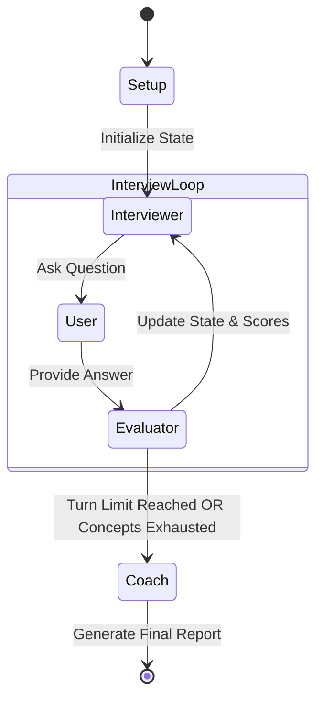

<<<<<<< HEAD
# AI Mock Interview Coach

A command-line based AI mock interview application designed to simulate technical interviews, evaluate candidate responses in real-time, and provide comprehensive coaching feedback.

## Architecture Overview

The application utilizes a deterministic state machine orchestrated by a central component, coordinating three specialized AI agents.

### Agents
1. **Interviewer Agent**: Generates contextually relevant, plain text interview questions based on the selected role, difficulty, and the candidate's previous responses. It progressively explores required concepts.
2. **Evaluator Agent**: Analyzes the candidate's response against the targeted concepts and current question. It operates in strict JSON mode to provide structured scoring (0-10) and actionable critique.
3. **Coach Agent**: Activates at the end of the interview to synthesize all turns, evaluator scores, and covered concepts into a comprehensive Markdown report, highlighting strengths and areas for improvement.

### Orchestration
The `Orchestrator` manages the `InterviewState` dataclass, routing control flow between the Interviewer, the User (candidate), and the Evaluator, until the turn limit (max 7) is reached or all required concepts are covered.



## Setup & Run Instructions

### Prerequisites
- Python 3.10+
- A Groq API Key

### Local Setup
1. **Clone the repository:**
   ```bash
   git clone <repository-url>
   cd interview_coach
   ```
2. **Create a `.env` file:**
   Create a `.env` file in the root directory and add your configuration:
   ```env
   GROQ_API_KEY=your_api_key_here
   GROQ_MODEL=llama3-70b-8192
   MAX_TURNS=7
   ```
3. **Install dependencies:**
   ```bash
   pip install -r requirements.txt
   ```
4. **Run the application:**
   ```bash
   python main.py
   ```

### Docker Setup
1. **Build the image:**
   ```bash
   docker build -t interview-coach .
   ```
2. **Run the container:**
   ```bash
   docker run -it --env-file .env interview-coach
   ```

## Key Design Decisions & Trade-offs

- **Zero-embedding role resolution**: We opted for a simple alias dictionary (`ROLE_ALIASES`) falling back to a general mode rather than using a complex vector search for role mapping. This drastically reduces cold start times and eliminates the need for an external vector database.
- **In-memory triplet storage**: Interview concepts are loaded from `roles.json` into in-memory triplets for O(1) retrieval, ensuring the orchestrator can instantly check remaining concepts without I/O overhead during the interview loop.
- **Context budgeting**: To keep LLM inference fast and prevent context window bloat, the state machine only injects `remaining_concepts` rather than the full concept list, ensuring the interviewer stays focused.
- **Strict JSON mode vs Free-text**: The Evaluator uses strict JSON output for robust, parsable scoring, while the Interviewer and Coach use free-text (or Markdown) to provide a natural conversational feel and readable reports.
- **Deterministic state machine vs LLM-driven orchestration**: Control flow is managed by deterministic Python logic rather than relying on an LLM to decide when to stop. This ensures predictable behavior and prevents the AI from getting stuck in infinite loops.
- **7-turn limit with early exit**: The interview is strictly capped at 7 turns to simulate a concise technical screen, but it can exit early if all required concepts for the role are successfully exhausted, saving time and API costs.

## Example Interview Transcripts

### Transcript 1: Strong Candidate (ML Engineer, Technical)

**Intake Inputs:**
- **Role**: ML Engineer
- **Difficulty**: Hard

**Turn 1**
- **Interviewer**: Welcome! Let's start by discussing attention mechanisms. Can you explain how Flash Attention optimizes the standard scaled dot-product attention, particularly regarding memory access patterns?
- **Candidate**: Standard attention requires materializing the O(N^2) attention matrix to HBM, which is a massive memory bottleneck for long sequences. Flash Attention uses tiling to compute exact attention in SRAM without writing the intermediate NxN matrix to HBM. It fuses the computation, significantly reducing memory reads/writes and speeding up inference and training.
- **Evaluator (JSON)**:
  ```json
  {
    "score": 9,
    "critique": "Excellent explanation. Accurately identified the O(N^2) memory bottleneck and correctly explained how tiling and kernel fusion in SRAM avoid HBM reads/writes.",
    "concepts_covered": ["Flash Attention", "Memory IO", "Tiling"]
  }
  ```

**Turn 2**
- **Interviewer**: Great explanation. Now, when fine-tuning large models, we often use Parameter-Efficient Fine-Tuning (PEFT) methods. Can you break down how LoRA works and why it's effective?
- **Candidate**: LoRA freezes the pre-trained model weights and injects trainable rank decomposition matrices into each layer of the Transformer architecture. Instead of updating the full weight matrix W, it updates W + BA, where B and A are low-rank matrices. This reduces the number of trainable parameters by orders of magnitude while maintaining comparable performance to full fine-tuning, making it highly memory-efficient.
- **Evaluator (JSON)**:
  ```json
  {
    "score": 9,
    "critique": "Spot on. Correctly defined the rank decomposition (W + BA) and the primary benefit of drastically reducing trainable parameters and memory footprint while freezing base weights.",
    "concepts_covered": ["LoRA", "PEFT", "Low-rank approximation"]
  }
  ```

**Turn 3**
- **Interviewer**: Moving on to generative systems. How would you design a Retrieval-Augmented Generation (RAG) pipeline, and what are the key challenges in ensuring the retrieved context is relevant?
- **Candidate**: I'd start with a vector database holding chunked and embedded documents using a dense retrieval model like sentence-transformers. When a query comes in, we embed it, retrieve top-K chunks via cosine similarity, and prepend them to the LLM prompt. Challenges include chunking strategy (semantic vs fixed), handling conflicting information in the retrieved chunks, and the 'lost in the middle' phenomenon where LLMs ignore context in the middle of long prompts. Re-ranking algorithms like Cohere's can help surface the most relevant chunks to the top.
- **Evaluator (JSON)**:
  ```json
  {
    "score": 8,
    "critique": "Very comprehensive. Covered the standard dense retrieval flow and correctly identified advanced challenges like chunking strategies, 'lost in the middle', and the need for re-ranking.",
    "concepts_covered": ["RAG", "Vector Databases", "Embeddings", "Re-ranking"]
  }
  ```

**Turn 4**
- **Interviewer**: Excellent. Finally, how do you handle deploying these large models to production efficiently?
- **Candidate**: I'd look into quantization, like INT8 or AWQ, to reduce the model size. Serving frameworks like vLLM with PagedAttention are crucial for handling concurrent requests efficiently by managing KV cache memory. We also need to set up robust monitoring for data drift and latency.
- **Evaluator (JSON)**:
  ```json
  {
    "score": 8,
    "critique": "Strong answer. Correctly mentioned modern techniques like vLLM, PagedAttention, and quantization for efficient serving.",
    "concepts_covered": ["Model Serving", "Quantization", "vLLM", "PagedAttention"]
  }
  ```

*(Interview exits early as core concepts are exhausted)*

**Coach Report Summary:**
```markdown
# Interview Feedback Report: ML Engineer

## Overall Performance
**Exceptional.** You demonstrated a deep understanding of modern ML engineering concepts, particularly around LLM optimization and architecture.

## Strengths
- **Deep Technical Knowledge**: Your explanations of Flash Attention and LoRA were textbook-perfect, highlighting exact mechanical benefits (SRAM tiling, rank decomposition).
- **System Design**: You showed a mature understanding of RAG pipelines, moving beyond basic retrieval to discuss chunking strategies and re-ranking.
- **Production Readiness**: Familiarity with vLLM and quantization shows strong practical deployment skills.

## Areas for Improvement
- Your answers were very strong, but you could optionally provide brief examples of specific use-cases where you've applied these techniques to ground your theoretical knowledge in practical experience.
```

---

### Transcript 2: Weak Candidate (Backend Engineer, Technical)

**Intake Inputs:**
- **Role**: Backend Engineer
- **Difficulty**: Medium

**Turn 1**
- **Interviewer**: Let's discuss database connections. Why is using a database connection pool important for a high-traffic web service?
- **Candidate**: A connection pool is good because it keeps the database from crashing. It puts all the connections in a pool so the web service can use them.
- **Evaluator (JSON)**:
  ```json
  {
    "score": 3,
    "critique": "Vague answer. Missed the core concepts of connection overhead (TCP/handshake costs) and reusing existing connections rather than opening/closing new ones per request.",
    "concepts_covered": []
  }
  ```

**Turn 2**
- **Interviewer**: Could you elaborate on *why* opening a new connection for every request is expensive? What exactly is happening under the hood?
- **Candidate**: I think it's because the database has to check your password every time, which takes a while.
- **Evaluator (JSON)**:
  ```json
  {
    "score": 2,
    "critique": "Incorrect focus. While authentication is a factor, the primary costs are TCP handshakes, network latency, and memory allocation on the DB server.",
    "concepts_covered": []
  }
  ```

**Turn 3**
- **Interviewer**: Let's pivot to microservices. Can you explain the Circuit Breaker pattern and when you would use it?
- **Candidate**: The circuit breaker is when you break the microservice into smaller parts. If one part breaks, the rest of the circuit is fine.
- **Evaluator (JSON)**:
  ```json
  {
    "score": 1,
    "critique": "Fundamental misunderstanding of the pattern. The candidate confused the Circuit Breaker pattern (preventing cascading failures by failing fast) with the general concept of decoupling microservices.",
    "concepts_covered": []
  }
  ```

**Turn 4**
- **Interviewer**: Actually, the Circuit Breaker pattern is used to stop making requests to a failing service. Have you used any specific caching strategies to reduce database load?
- **Candidate**: I don't know much about caching strategies, sorry.
- **Evaluator (JSON)**:
  ```json
  {
    "score": 0,
    "critique": "Candidate explicitly stated they do not know.",
    "concepts_covered": []
  }
  ```

**Coach Report Summary:**
```markdown
# Interview Feedback Report: Backend Engineer

## Overall Performance
**Needs Improvement.** The interview revealed significant gaps in foundational backend concepts, particularly around database interactions and distributed systems patterns.

## Strengths
- You were honest about what you didn't know in the final question, which is better than guessing.

## Areas for Improvement
- **Database Connection Lifecycles**: Review how TCP connections work and why connection pooling is necessary to avoid overhead (handshakes, memory allocation).
- **Design Patterns**: The Circuit Breaker pattern is critical for microservices to prevent cascading failures. It's recommended to study common distributed systems patterns (Retry, Circuit Breaker, Bulkhead).
- **Caching**: Caching (e.g., Redis, Memcached) is a staple of backend engineering. Study strategies like Cache-Aside, Write-Through, and Write-Behind.
```

---

### Transcript 3: Tricky/Edge Case (Unknown Role → Fallback + Off-topic)

**Intake Inputs:**
- **Role**: Blockchain Developer (Falls back to General Software Engineering mode)
- **Difficulty**: Medium

**Turn 1**
- **Interviewer**: We don't have specific modules for Blockchain, so let's focus on general software engineering principles. Can you explain the difference between optimistic and pessimistic locking in a database?
- **Candidate**: Optimistic locking is when you just hope the transaction works, and pessimistic is when you assume it will fail so you retry it a lot. Also, speaking of databases, I think Solana's state compression is really cool for reducing on-chain storage costs.
- **Evaluator (JSON)**:
  ```json
  {
    "score": 2,
    "critique": "Incorrect definition of database locking mechanisms. Candidate went off-topic to discuss Solana rather than addressing concurrency control. Optimistic locking uses version numbers/timestamps, while pessimistic locks the row immediately.",
    "concepts_covered": []
  }
  ```

**Turn 2**
- **Interviewer**: Let's bring it back to general concurrency. In optimistic locking, we typically use a version number. What happens if two transactions try to update the same row simultaneously with optimistic locking?
- **Candidate**: The first one to commit succeeds. The second one will see that the version number changed and it will throw an error, so the application has to handle that error and maybe try again.
- **Evaluator (JSON)**:
  ```json
  {
    "score": 8,
    "critique": "Good recovery. Accurately described the mechanics of optimistic locking conflict resolution (version checking and application-level retries).",
    "concepts_covered": ["Optimistic Locking", "Concurrency Control", "Version checking"]
  }
  ```

**Turn 3**
- **Interviewer**: Good. Now, how would you design an API rate limiter for a distributed application?
- **Candidate**: I would just use a simple counter in a database table. Every time a user makes a request, increment the counter. If it's over the limit, block them.
- **Evaluator (JSON)**:
  ```json
  {
    "score": 4,
    "critique": "Partial answer. While a counter works conceptually, doing a database write per request introduces massive latency. Missed distributed caching (Redis) and specific algorithms like Token Bucket or Sliding Window.",
    "concepts_covered": ["Rate Limiting", "Counters"]
  }
  ```

**Coach Report Summary:**
```markdown
# Interview Feedback Report: General Software Engineering (Fallback)

## Overall Performance
**Mixed.** You had a rocky start with some conceptual misunderstandings and off-topic tangents, but recovered well when prompted with clarifying questions.

## Strengths
- **Adaptability**: After struggling with the initial locking question, you correctly deduced the mechanics of optimistic locking when given a hint about version numbers.

## Areas for Improvement
- **Focus**: Try to answer the specific question asked before pivoting to niche interests (like Solana state compression) unless it directly answers the prompt.
- **Scalability**: Your API rate limiter design using a standard database table would not scale. Review distributed system concepts, specifically using in-memory stores like Redis and standard rate-limiting algorithms (Token Bucket, Leaky Bucket).
- **Concurrency Fundamentals**: Ensure you have a solid grasp of basic database isolation levels and locking mechanisms.
```
=======
# AI_prototype_engineer
>>>>>>> 1f1b7f5c08ed47804b312af5e6ffb1cbc13223f0
